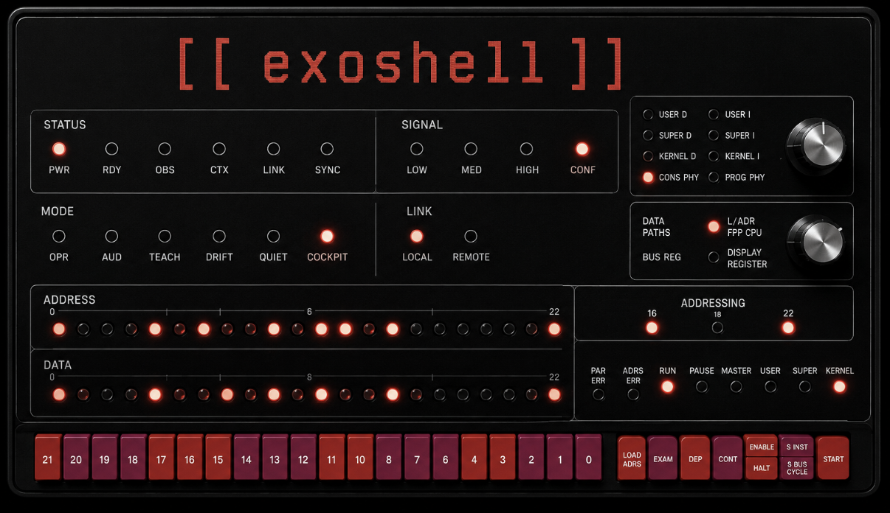

# Exoshell

A cognitive shell for engineers who still want the controls.



Exoshell is a local-first, shell-adjacent assistant for practitioners who want AI help without giving up operational awareness or control. The shell remains primary; Exoshell suggests, explains, preserves context, and keeps the human in the loop. Exoshell is not designed for “vibe coding.”

Start here: [Quickstart and Tour](docs/quickstart.md).

For the full project philosophy and design direction, read [docs/DESIGN.md](docs/DESIGN.md).

## Philosophy

Exoshell exists because AI tooling should make skilled operators sharper, not less aware. It should preserve flow, reduce cognitive overhead, and help users understand the systems they are working on.

The shell remains primary. Exoshell lives beside it as an operational overlay: it suggests commands, explains tradeoffs, surfaces uncertainty, records useful context, and leaves execution under human control.

The project prefers visible systems over hidden automation, review over blind action, and deterministic tools over unnecessary AI. If `awk`, `jq`, `rg`, `git`, or a platform-native command is the right tool, Exoshell should say so.

Exoshell is local-first, terminal-native, inspectable, hackable, and practitioner-oriented. It is not an autonomous coding employee, a replacement shell, a manager dashboard, or a hidden context accumulation system.

Sacred rule: enhance skill; do not replace it.

## Project State

Phase 1 and Phase 1.5 are closed.

The current implementation supports the first shell-adjacent model chat milestone: a Rust CLI, OpenAI-compatible provider abstraction, PowerShell/POSIX shell-family selection, command-suggestion formatting, markdown transcripts, and a basic interactive REPL.

The codebase also contains the Phase 1.5 context engine foundation: context entries, provenance metadata, priority and size estimates, a session context store, provider registry, default manual/file/command-output/stdin/directory-summary providers, context REPL commands, deterministic pruning, budget checks, transcript events, startup context flags, piped stdin import, and prompt-context rendering.

The active milestone is Phase 3. The current implementation adds stance selection, explicit prompt assembly, visible prompt/context budget estimates, command suggestion IDs, simple risky-command warnings, command copy/explain/discard actions, a plain terminal session panel, Phase 2 help text, configurable model routing, initial Git-native project detection, attachable Git status context, attachable Git diff context, and attachable recent commit context.

The broader roadmap is tracked in [docs/PHASES.md](docs/PHASES.md) and [docs/tasks](docs/tasks).

## Running Locally

Phase 1 run instructions live in [docs/phase1_run.md](docs/phase1_run.md).

Quick start:

```sh
cargo run
```

Use a config file:

```sh
cargo run -- --config path/to/config.toml
```

Select a shell dialect:

```sh
cargo run -- --shell powershell
cargo run -- --shell posix
```

Select an operating stance:

```sh
cargo run -- --stance audit
```

Override the detected project root:

```sh
cargo run -- --project-root path/to/repo
```

Configure model routing:

```toml
[router]
enabled = true
model = "qwen2.5-coder:7b"
fallback_role = "coding"
```

The default router roles are `instant`, `coding`, `heavy`, and `conversational`. For Ollama model setup examples, see [khodges42/modelfiles](https://github.com/khodges42/modelfiles).

Exoshell suggests commands. It does not execute them.

## Quality Checks

```sh
cargo fmt --check
cargo test
cargo clippy --all-targets --all-features
```

On Windows PowerShell, the Phase 1 smoke test is:

```powershell
powershell -ExecutionPolicy Bypass -File scripts\manual_phase1_startup.ps1
```

## Documentation

- [Design](docs/DESIGN.md): project philosophy, interaction model, non-goals, and technical direction.
- [Context Engine](docs/context_engine.md): explicit context model, providers, commands, budgets, transcripts, serialization, and redaction limits.
- [Phase 2 Interaction Model](docs/phase2_interaction_model.md): prompts, stances, command suggestions, operator actions, and current limitations.
- [Phases](docs/PHASES.md): staged roadmap from Phase 1 through the mature cognitive shell overlay.
- [Phase 1 Run Guide](docs/phase1_run.md): local setup, config examples, CLI flags, and current limitations.
- [Versioning](docs/versioning.md): semantic versioning and release naming rules.
- [Open Questions](docs/questions.md): decisions that still need explicit agreement.

## Contributing

Contributions are welcome, including from people who are learning Rust, terminal tooling, AI integration, or open source contribution workflows.

Before making a larger change, please read [docs/DESIGN.md](docs/DESIGN.md) so you understand the philosophy of the project. Exoshell is intentionally not an autonomous coding employee or a replacement shell. The core idea is to enhance skill, preserve understanding, and keep the operator in control.

Good contributions can be small:

- clarifying docs
- improving error messages
- adding focused tests
- tightening shell-specific behavior
- fixing platform issues
- turning roadmap items into small implementation tasks

If you are unsure where to start, open an issue or ask a question. It is fine to say what you are trying to learn; the project should be friendly to careful beginners as well as experienced systems people.

When changing release-visible behavior, also check [docs/versioning.md](docs/versioning.md).

## License

Exoshell is licensed under the GNU General Public License v3.0 or later. See [LICENSE](LICENSE).
